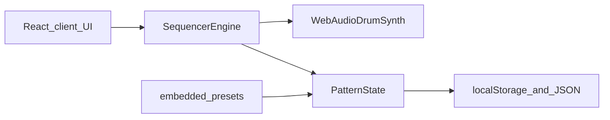

# 808-style–style web drum machine

## Context

The workspace [`/Users/erikholmberg/Development/80808`](80808) is **empty**, so this is a **greenfield** build. The UI should evoke the 808-style (12 instruments, 16-step sequencer) without implying Roland endorsement—use neutral naming in copy (e.g. “808-style drum machine”).

## Recommended stack

| Piece | Choice | Why |
|--------|--------|-----|
| App | **Next.js (App Router) + TypeScript** | Same React component model; easy deploy to Vercel; routing ready if you add more pages later |
| Styling | **CSS modules, `app/globals.css`, or Tailwind** (if chosen at scaffold) | Keep UI cohesive with retro panel styling |
| Audio | **Web Audio API** | No backend required; runs as a client-side experience |

### Next.js-specific constraints

- **`AudioContext`, `keydown` / `keyup`, `localStorage`, and file download** only run in the browser. Put the drum machine UI and hooks in **`'use client'`** components (e.g. a single `DrumMachine` tree imported from [`app/page.tsx`](80808/app/page.tsx)).
- Keep [`app/layout.tsx`](80808/app/layout.tsx) mostly server-safe (metadata, fonts, global styles). The home page can be a thin server component that renders the client shell.
- Static assets (pixel PNG) live in [`public/drum-machine-pixel.png`](80808/public/drum-machine-pixel.png) as usual (`next/image` or `` with `image-rendering: pixelated`).

## Architecture

- **Sequencer**: `requestAnimationFrame` or `AudioContext` scheduled ticks at BPM; maintains **playhead 0–15** and **which steps are “on” per instrument** (12 × 16 booleans, optionally velocities later).
- **Drum engine**: One `AudioContext`; per-hit scheduling with short envelopes (synthesized **approximations** of BD/SD/hats/toms/cowbell—good enough for a browser demo without shipping copyrighted samples). Optional later upgrade: swap to short PCM buffers for closer sound.
- **Input**: Pointer/touch on pad buttons **and** `keydown` / `keyup` (prevent default where needed). Maintain **active key state** per mapped instrument so the UI can mirror physical key presses in real time.

## UI layout

1. **Top**: Full-width **8-bit / pixel machine graphic** — place image at [`public/drum-machine-pixel.png`](80808/public/drum-machine-pixel.png) (you supply the asset) with `max-height` and `image-rendering: pixelated`. Until the file exists, ship a **simple SVG placeholder** with the same dimensions so layout does not jump.
2. **Directly under the image — keyboard mapping strip**: A clear legend (e.g. row of **kbd-style chips** or a small table) listing **each computer key → voice label** (BD, SD, …) so users never guess the mapping. The legend is driven by the same config as [`src/keymap.ts`](80808/src/keymap.ts).
3. **Pressed-key feedback (two places at once)**:
   - **Legend**: When a mapped key is held, that legend entry **lights up** (background / border / glow) until `keyup`.
   - **Machine graphic**: Over each instrument button on the artwork, place an **invisible hit region** (or semi-transparent overlay) aligned to the pad in the pixel image. On press, apply a **“depressed”** state: e.g. `translateY(2px)` + darker overlay + optional inner shadow so the pad looks pushed in; release on `keyup`. Use **percent-based positioning** (`top/left/width/height` as `%` of the image container) so alignment survives responsive scaling; tune coordinates once when the final PNG/SVG dimensions are known.
   - **Click/touch on the graphic** should trigger the same voice, update legend highlight, and depress the pad — same code path as keyboard where possible.
4. **Main**: **16-column step grid** (rows = 12 instruments matching classic 808 voice names: BD, SD, LT, MT, HT, RS, CP, MA, CH, OH, CY, CB) **or** pads + separate matrix—**recommended**: one matrix (toggle steps) plus optional **pad strip** for live triggering without toggling a step.
5. **Transport**: Play / Stop, **BPM** (40–200), **Clear pattern**, **Swing** (optional nice-to-have).
6. **Recording / saving “beats”** (interpreted as **pattern data**, not a WAV recorder):
   - **Save**: Serialize `{ name, bpm, steps }` → **Download `.json`** and **autosave last pattern** to `localStorage`.
   - **Load**: File input or paste; validate shape before applying.
7. **Precrated beats**: [`src/presets.ts`](80808/src/presets.ts) (or [`lib/presets.ts`](80808/lib/presets.ts) if using `src/`) exporting an array of named patterns (e.g. 6–10 starter grooves). Dropdown or card list: **“Load preset”** copies preset into the active pattern.

## Default keyboard map (example)

Use a consistent row-based map (adjust to taste in one config object):

- Row 1: `1 2 3 4 5 6` → first six instruments  
- Row 2: `q w e r t y` → next six  

Expose [`src/keymap.ts`](80808/src/keymap.ts) so users can change mappings in one place.

Optional [`src/machinePadLayout.ts`](80808/src/machinePadLayout.ts): exports **12 rectangles** in normalized coordinates `{ voiceId, top, left, width, height }` (0–1 or 0–100%) for overlay alignment on the machine graphic—adjust when swapping art assets.

## File / module sketch (Next.js)

- [`app/layout.tsx`](80808/app/layout.tsx) — root layout, metadata, global CSS import
- [`app/page.tsx`](80808/app/page.tsx) — home page (can import client drum machine)
- [`app/components/DrumMachine.tsx`](80808/app/components/DrumMachine.tsx) — `'use client'`; orchestrates grid, transport, audio
- [`app/components/MachineGraphic.tsx`](80808/app/components/MachineGraphic.tsx) (or similar) — wrapped machine image + **percent-positioned pad overlays** + optional click targets; receives `activeVoiceId` / `pressed` from parent
- [`app/components/KeyboardMapLegend.tsx`](80808/app/components/KeyboardMapLegend.tsx) — mapping strip under the image; highlights active key
- [`src/audio/drumKit.ts`](80808/src/audio/drumKit.ts) — `playVoice(ctx, voiceId, time, accent?)` (imported only from client code)
- [`src/audio/sequencer.ts`](80808/src/audio/sequencer.ts) — tick scheduling, queue hits from pattern
- [`src/state/pattern.ts`](80808/src/state/pattern.ts) — pattern type + toggles
- [`src/components/StepGrid.tsx`](80808/src/components/StepGrid.tsx), [`Transport.tsx`](80808/src/components/Transport.tsx), [`PresetPicker.tsx`](80808/src/components/PresetPicker.tsx)
- [`next.config.ts`](80808/next.config.ts) — defaults are fine unless you add image domains later

Scaffold with `create-next-app` using **App Router**, **TypeScript**, and optionally **`src/`** directory for a clear split between `app/` routes and shared `src/` modules.

## Out of scope for first version (unless you want them)

- Audio **file** export (offline render to WAV) — extra work; pattern JSON already satisfies “save beats.”
- Exact analog modeling of the original hardware.

## Legal / branding

Avoid “Roland” in the product title; “808-style” or “classic drum machine” is safer. Your **pixel art** can be original artwork inspired by the layout.

## Implementation order

1. Scaffold Next.js (App Router, TS); verify `next dev`.
2. Implement minimal drum voices + manual pad trigger (keyboard + click) inside client components.
3. Add 16-step grid state + playback loop synced to `AudioContext`.
4. Presets module + UI; localStorage + JSON export/import.
5. Pixel header asset hookup; **keyboard legend + pad overlays** (tweak `machinePadLayout` to match art).
6. Styling polish (retro panel colors, monospace labels).
