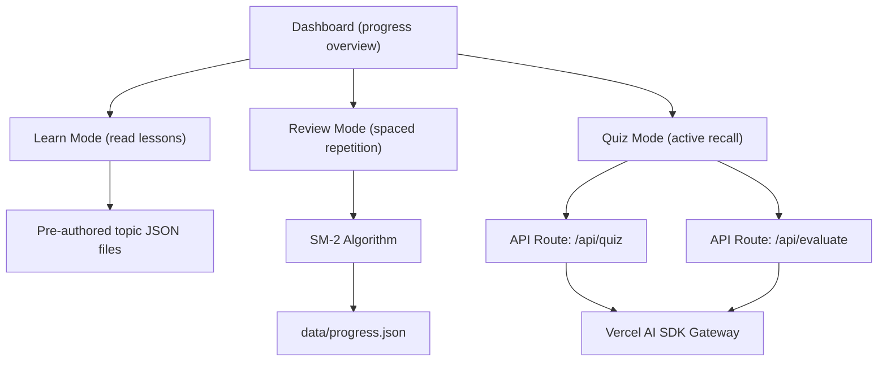

# AI Expert -- AI PM Interview Prep App

## Architecture



## Tech Stack

- **Framework**: Next.js 15 (App Router) with TypeScript
- **Styling**: Tailwind CSS v4 + shadcn/ui components
- **LLM**: Vercel AI SDK v5 with AI Gateway (provider-agnostic, single API key)
- **SRS**: Custom SM-2 implementation (no external dependency needed, ~60 lines)
- **Storage**: JSON file on disk (`data/progress.json`) read/written via API routes
- **Package manager**: pnpm

## Project Structure

```
ai-expert/
  app/
    page.tsx                    # Dashboard: topic grid, progress stats, due reviews
    layout.tsx                  # Root layout with nav
    learn/[topicId]/page.tsx    # Lesson viewer for a topic
    review/page.tsx             # Spaced repetition session (due cards)
    quiz/[topicId]/page.tsx     # Active recall quiz for a topic
    api/
      quiz/route.ts             # Generate quiz questions via LLM
      evaluate/route.ts         # Evaluate free-text answers via LLM
      progress/route.ts         # Read/write progress.json
  lib/
    srs.ts                      # SM-2 spaced repetition algorithm
    topics.ts                   # Load and query topic content
    types.ts                    # Shared TypeScript types
  content/
    topics/
      01-ml-fundamentals.json   # Each topic: title, sections, key concepts, flashcards
      02-deep-learning.json
      ... (20 files)
  data/
    progress.json               # User progress: completed lessons, SRS card states, quiz scores
```

## Curriculum (20 Topics)

Organized into 4 pillars:

**Pillar 1 -- Technical Foundations (7 topics)**
1. Machine Learning Fundamentals (supervised, unsupervised, reinforcement)
2. Deep Learning and Neural Networks
3. Natural Language Processing and LLMs
4. Foundation Models, Fine-Tuning, and RAG
5. Computer Vision Basics
6. Recommender Systems and Personalization
7. Agentic AI, Tool Use, and Multi-Modal Systems

**Pillar 2 -- AI Product Craft (5 topics)**
8. AI Product Design (probabilistic UX, graceful failure)
9. Human-in-the-Loop Systems and Trust Building
10. AI Evaluation, Metrics, and Evals
11. Prompt Engineering for Product Managers
12. AI UX Patterns and Interaction Design

**Pillar 3 -- Strategy and Business (4 topics)**
13. AI Product Strategy (build vs. buy, data moats)
14. AI Business Cases, ROI, and Pricing
15. Data Strategy and Data Pipelines
16. MLOps and Model Deployment Basics

**Pillar 4 -- Safety, Ethics, and Governance (4 topics)**
17. AI Safety and Alignment
18. AI Ethics, Bias, and Fairness
19. AI Regulation and Compliance (EU AI Act, etc.)
20. Responsible AI Frameworks and Practices

## Each Topic File Format

```json
{
  "id": "ml-fundamentals",
  "title": "Machine Learning Fundamentals",
  "pillar": "Technical Foundations",
  "order": 1,
  "sections": [
    {
      "heading": "What is Machine Learning?",
      "content": "Markdown content explaining the concept...",
      "keyTakeaway": "One-sentence summary"
    }
  ],
  "flashcards": [
    {
      "id": "ml-fund-001",
      "front": "What is the difference between supervised and unsupervised learning?",
      "back": "Supervised learning uses labeled data...",
      "difficulty": "beginner"
    }
  ],
  "quizPrompts": [
    "Explain the bias-variance tradeoff in your own words.",
    "A stakeholder asks why your ML model's accuracy dropped. Walk through your debugging approach."
  ]
}
```

## Key Features

### 1. Dashboard (`app/page.tsx`)
- Topic grid grouped by pillar, showing completion status (not started / in progress / mastered)
- Stats bar: topics completed, cards due for review, overall mastery %
- "Start Review" button when spaced repetition cards are due

### 2. Learn Mode (`app/learn/[topicId]/page.tsx`)
- Renders lesson content section-by-section with key takeaways highlighted
- "Mark as Complete" button that updates progress and unlocks flashcards for this topic
- Navigation between topics (prev/next)

### 3. Review Mode (`app/review/page.tsx`)
- Pulls all due flashcards across topics using SM-2 scheduling
- Card flip interaction (click to reveal answer)
- Self-rating buttons: Again (0) / Hard (2) / Good (4) / Easy (5)
- Updates SRS state (interval, ease factor, next review date) in progress.json
- Session summary showing cards reviewed and retention rate

### 4. Quiz Mode (`app/quiz/[topicId]/page.tsx`)
- LLM generates 3-5 questions per session based on topic content and quiz prompts
- Mix of: explain-a-concept, scenario-based, and compare/contrast questions
- User writes free-text answers
- LLM evaluates each answer: score (1-5), feedback, model answer
- Results saved to progress for tracking improvement over time

### 5. SM-2 Algorithm (`lib/srs.ts`)
- Custom implementation (~60 lines), no external package needed
- Tracks per card: `interval`, `repetition`, `efactor`, `nextReview`
- New cards start with interval=1 day, efactor=2.5
- Quality grades 0-5 map to the self-rating buttons

## API Routes

- **POST `/api/quiz`** -- Sends topic content + quiz prompts to LLM, returns generated questions. Uses `generateObject` from AI SDK for structured output.
- **POST `/api/evaluate`** -- Sends question + user answer + topic context to LLM, returns score + feedback. Uses `generateObject` for structured evaluation.
- **GET/POST `/api/progress`** -- Reads and writes `data/progress.json`.

## Implementation Order

Build in layers so the app is usable at each stage:

1. **Scaffold** -- Next.js project, Tailwind, shadcn/ui, project structure
2. **Content** -- Create all 20 topic JSON files with lessons, flashcards, and quiz prompts
3. **Learn Mode** -- Topic list + lesson viewer (static content, no LLM needed)
4. **Progress tracking** -- JSON file storage, API route, mark topics complete
5. **Review Mode** -- SM-2 algorithm + flashcard UI
6. **Quiz Mode** -- LLM integration via Vercel AI SDK, question generation, answer evaluation
7. **Dashboard** -- Stats, progress visualization, due card count
8. **Polish** -- Responsive design, keyboard shortcuts, dark mode