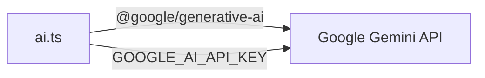
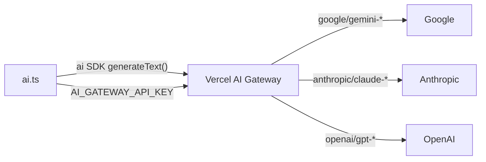

# Migrate to Vercel AI Gateway (Multi-Provider)

## Summary

Replace `@google/generative-ai` with the Vercel AI SDK (`ai` package), routing all model calls through AI Gateway. This enables multi-provider model access (Google, Anthropic, OpenAI, etc.), built-in observability via the Vercel dashboard, model fallbacks, and usage tracking -- all through a single `AI_GATEWAY_API_KEY`.

## Current Architecture



## Target Architecture



## Files to Change

### 1. Dependencies (`package.json`)

- **Remove:** `@google/generative-ai`
- **Add:** `ai` (Vercel AI SDK, latest v6)

### 2. Environment Variables

- **Remove:** `GOOGLE_AI_API_KEY`
- **Add:** `AI_GATEWAY_API_KEY` (created in Vercel Dashboard > AI Gateway > API Keys)
- Update [`.env`](.env), any `.env.example` references, [`SPECIFICATION.md`](SPECIFICATION.md), [`DEPLOYMENT.md`](DEPLOYMENT.md), [`README.md`](README.md)

### 3. Core AI Module -- [`src/lib/ai.ts`](src/lib/ai.ts)

This is the main change. Replace all `GoogleGenerativeAI` usage with `generateText` from the `ai` package. The model string format changes from `gemini-2.0-flash` to `google/gemini-2.0-flash`.

**Before:**
```typescript
import { GoogleGenerativeAI } from "@google/generative-ai";
const genAI = new GoogleGenerativeAI(process.env.GOOGLE_AI_API_KEY || "");

// In each function:
const modelId = await getAgentModel(AGENTS.SEARCH_QUERY_GENERATOR);
const model = genAI.getGenerativeModel({ model: modelId });
const result = await model.generateContent(prompt);
const text = result.response.text().trim();
```

**After:**
```typescript
import { generateText } from "ai";

// In each function:
const modelId = await getAgentModel(AGENTS.SEARCH_QUERY_GENERATOR);
const { text } = await generateText({
  model: modelId, // e.g. "google/gemini-2.0-flash"
  prompt,
});
```

All 6 functions follow the same pattern -- the prompt strings stay identical, only the API call mechanism changes. The `generateText` return gives `{ text, usage, finishReason }` directly.

### 4. Agent Configuration -- [`src/lib/agents.ts`](src/lib/agents.ts)

- Change `defaultModel` from `"gemini-2.0-flash"` to `"google/gemini-2.0-flash"` in `AGENT_DEFINITIONS`
- Replace the hardcoded `AVAILABLE_MODELS` array with dynamic model discovery via `gateway.getAvailableModels()`, or replace with a curated multi-provider list:

```typescript
export const AVAILABLE_MODELS = [
  // Google
  { id: "google/gemini-2.0-flash", name: "Gemini 2.0 Flash", provider: "Google" },
  { id: "google/gemini-2.0-flash-lite", name: "Gemini 2.0 Flash Lite", provider: "Google" },
  { id: "google/gemini-2.5-flash", name: "Gemini 2.5 Flash", provider: "Google" },
  // Anthropic
  { id: "anthropic/claude-sonnet-4", name: "Claude Sonnet 4", provider: "Anthropic" },
  { id: "anthropic/claude-haiku-3.5", name: "Claude Haiku 3.5", provider: "Anthropic" },
  // OpenAI
  { id: "openai/gpt-4o-mini", name: "GPT-4o Mini", provider: "OpenAI" },
  { id: "openai/gpt-4o", name: "GPT-4o", provider: "OpenAI" },
  // ...
];
```

- Also add an API function to dynamically fetch available models from AI Gateway for the admin UI:

```typescript
import { gateway } from "ai";

export async function fetchAvailableModels() {
  const { models } = await gateway.getAvailableModels();
  return models;
}
```

### 5. Admin Test Endpoint -- [`src/app/api/admin/agents/test/route.ts`](src/app/api/admin/agents/test/route.ts)

Replace the Google-specific API test with an AI Gateway connection test:

```typescript
import { generateText } from "ai";

// Test by making a simple generateText call
const { text } = await generateText({
  model: "google/gemini-2.0-flash",
  prompt: "Reply with OK",
});
```

Or use `gateway.getAvailableModels()` to verify the connection and list models.

### 6. Remove Claude Test Endpoint

[`src/app/api/admin/agents/test-claude/route.ts`](src/app/api/admin/agents/test-claude/route.ts) can be removed entirely -- Claude models are now accessible through the same AI Gateway as everything else.

### 7. Database Migration

Existing `AgentConfig` rows in the database store model IDs like `"gemini-2.0-flash"`. These need to be prefixed with `"google/"` to become `"google/gemini-2.0-flash"`. Options:

- Add a migration script that updates all existing rows
- Or handle it in `getAgentModel()` with a backwards-compatibility check: if the model string doesn't contain `/`, prefix it with `"google/"`

The backwards-compatibility approach is safer and avoids requiring a manual migration:

```typescript
export async function getAgentModel(key: AgentKey): Promise<string> {
  // ... existing lookup ...
  const model = config?.model ?? AGENT_DEFINITIONS[key]?.defaultModel ?? "google/gemini-2.0-flash";
  // Backwards compatibility: prefix bare model names with google/
  if (!model.includes("/")) {
    return `google/${model}`;
  }
  return model;
}
```

### 8. Prisma Schema -- [`prisma/schema.prisma`](prisma/schema.prisma)

Update the `AgentConfig` model default:

```prisma
model AgentConfig {
  // ...
  model String @default("google/gemini-2.0-flash")
}
```

Run `npx prisma db push` after.

### 9. Admin UI (optional improvement)

The admin page at [`src/app/(dashboard)/admin/page.tsx`](src/app/(dashboard)/admin/page.tsx) currently renders a dropdown of models from `AVAILABLE_MODELS`. With multi-provider support, consider grouping models by provider in the dropdown using `<optgroup>` or a more structured select component. This is a UI polish step, not strictly required.

## Migration Checklist

1. Install `ai`, remove `@google/generative-ai`
2. Add `AI_GATEWAY_API_KEY` to `.env` and Vercel env vars
3. Update `src/lib/ai.ts` (6 functions)
4. Update `src/lib/agents.ts` (models list, defaults, backwards compat)
5. Update `prisma/schema.prisma` default, run `db push`
6. Update admin test endpoint
7. Remove test-claude endpoint
8. Remove `GOOGLE_AI_API_KEY` from env
9. Update documentation (SPECIFICATION.md, DEPLOYMENT.md, README.md)
10. Test all AI features: research, scoring, summarization, draft generation

## Risks and Considerations

- **Latency:** AI Gateway adds a routing hop; should be negligible since the app is already deployed on Vercel
- **Availability:** AI Gateway provides automatic retries and model fallbacks, which is an improvement over direct API calls
- **Cost:** No markup on tokens from AI Gateway when using an API key. Multi-provider access means you can optimize cost by choosing cheaper models per agent
- **Existing data:** The backwards-compatibility prefix in `getAgentModel()` handles existing database rows without a migration
