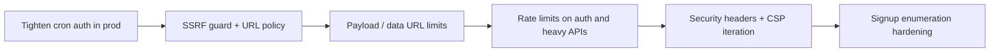

# Security recommendations for Quick Letter

## What is already in good shape

- **Passwords**: Hashed with `bcrypt` at cost factor 12 in [src/app/api/auth/signup/route.ts](src/app/api/auth/signup/route.ts) and [src/app/api/auth/change-password/route.ts](src/app/api/auth/change-password/route.ts).
- **API authorization**: Authenticated handlers use `auth()` and enforce **topic ownership** (e.g. [src/app/api/topics/[topicId]/items/from-url/route.ts](src/app/api/topics/[topicId]/items/from-url/route.ts)); **admin** routes load `isAdmin` from the database again (e.g. [src/app/api/admin/users/route.ts](src/app/api/admin/users/route.ts)), so revoking admin in DB is effective even if the JWT still has a stale claim.
- **Cron hardening (when configured)**: [src/app/api/cron/research/route.ts](src/app/api/cron/research/route.ts) checks `Authorization: Bearer <CRON_SECRET>` when `CRON_SECRET` is set.
- **Secrets on server**: Supabase uses the **service role** only inside server modules like [src/lib/supabase-storage.ts](src/lib/supabase-storage.ts) (not exposed to the client bundle).

---

## Critical / high priority

### 1. Cron endpoint when `CRON_SECRET` is unset

Today, if `CRON_SECRET` is **not** set, the bearer check is skipped entirely, so `**GET /api/cron/research` becomes public** and can trigger expensive work (Serper + AI + storage).

```33:40:src/app/api/cron/research/route.ts
  // Verify cron secret in production
  const authHeader = req.headers.get("authorization");
  if (
    process.env.CRON_SECRET &&
    authHeader !== `Bearer ${process.env.CRON_SECRET}`
  ) {
    return NextResponse.json({ error: "Unauthorized" }, { status: 401 });
  }
```

**Recommendation**: In production (e.g. `VERCEL` or `NODE_ENV === "production"`), **require** `CRON_SECRET` and return 401 if the header is wrong **or** if the env var is missing. Keep dev flexible if you need local testing.

### 2. SSRF risk on user-supplied URLs

[src/app/api/topics/[topicId]/items/from-url/route.ts](src/app/api/topics/[topicId]/items/from-url/route.ts) and [src/lib/scraper.ts](src/lib/scraper.ts) `fetch` arbitrary URLs after minimal validation (`new URL`). That can reach **loopback, RFC1918, cloud metadata IPs**, and internal hostnames, depending on deployment network.

**Recommendation**:

- Allow only `http:` / `https:` (reject `file:`, `data:` for **network** fetches if you split image data URLs from HTTP fetch paths—or keep data URLs but never `fetch` them as URLs).
- Resolve hostname and **block** private/link-local/metadata ranges (or use a dedicated SSRF-safe fetch helper / DNS pinning pattern).
- Optionally restrict schemes and redirect behavior (e.g. cap redirects, or validate each hop).

### 3. DoS via large payloads (data URLs and bodies)

Data URL images are accepted and decoded in [src/lib/supabase-storage.ts](src/lib/supabase-storage.ts) without an obvious **max decoded size** cap; a huge base64 string can exhaust memory/CPU.

**Recommendation**: Enforce **max body size** on `from-url` POST and **max decoded bytes** for data URLs before `Buffer.from`.

---

## Medium priority

### 4. Rate limiting and abuse controls

There is **no** `middleware.ts` and no application-level throttling visible on **login**, **signup**, or **expensive** routes (`from-url`, manual research, draft generation). Authenticated abuse can still burn **Serper / AI / Supabase** quotas.

**Recommendation**: Add rate limits (e.g. Vercel Firewall rules, Upstash Ratelimit in route handlers, or Edge middleware) keyed by IP + user id for sensitive actions.

### 5. Security headers

[next.config.ts](next.config.ts) only configures `images.remotePatterns`; there are no global `**Content-Security-Policy`**, `**Strict-Transport-Security**`, `**X-Content-Type-Options**`, or `**Referrer-Policy**` headers.

**Recommendation**: Add a conservative `headers()` block in `next.config.ts` (start with HSTS on production, `nosniff`, `Referrer-Policy`, frame control). Tune CSP incrementally—strict CSP can break third-party scripts if you add them later.

### 6. Account enumeration on signup

[signup/route.ts](src/app/api/auth/signup/route.ts) returns a specific error when the email already exists, which aids **email enumeration**.

**Recommendation**: Return a **generic** success-style message and avoid distinguishing “exists” vs “created” in the public API (still log server-side).

### 7. Error detail in production

`from-url` can return `details: errorMessage` on 500 responses, which may leak stack-adjacent or internal wording.

**Recommendation**: In production, return a fixed client message and log details server-side only.

### 8. `next/image` remote patterns

```4:10:next.config.ts
  images: {
    remotePatterns: [
      {
        protocol: "https",
        hostname: "**",
      },
    ],
  },
```

Any HTTPS host is allowed for image optimization. That is convenient but broad; pairing with **CSP `img-src`** reduces risk if you ever render untrusted URLs in unexpected ways.

**Recommendation**: If you can enumerate hosts (Supabase storage, known CDNs), narrow patterns; otherwise rely on CSP and strict URL validation where images are rendered.

---

## Lower priority / operational

- **JWT/session**: You use JWT sessions ([src/lib/auth.ts](src/lib/auth.ts)); consider **short session lifetime** or refresh strategy if you want tighter revocation (DB password changes do not invalidate existing JWTs until expiry unless you add rotation/invalidation).
- **Dependency and secret hygiene**: Run `npm audit` in CI; ensure `.env` never committed (workspace showed `.env` in glob results—verify it is gitignored and not pushed).
- **Supabase**: Confirm buckets use **least-privilege** policies; public URLs are expected for images—ensure listing/upload paths cannot be abused from the client without the service key.
- **Admin**: For high-risk accounts, consider **MFA** or IP allowlists at the edge if threats warrant it.

---

## Suggested implementation order




No code changes are included in this plan; it is advisory until you choose which items to implement.