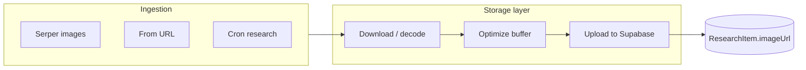

# Reducing image research item resolution and file size

## Current behavior

- **Ingestion**: Images are added via (1) Serper image search in [src/app/api/topics/[topicId]/research/route.ts](src/app/api/topics/[topicId]/research/route.ts) and cron [src/app/api/cron/research/route.ts](src/app/api/cron/research/route.ts), (2) URL extraction in [src/app/api/topics/[topicId]/items/from-url/route.ts](src/app/api/topics/[topicId]/items/from-url/route.ts) (data URL or page images).
- **Storage**: [src/lib/supabase-storage.ts](src/lib/supabase-storage.ts) downloads the image (or decodes a data URL) into a `Buffer` and uploads it **as-is** to Supabase Storage or local `public/uploads/images/`. No resize, re-encode, or file-size cap.
- **Display**: [src/components/research-item-list.tsx](src/components/research-item-list.tsx) uses plain `` for list thumbnails (~80×56px), image grid cards, and lightbox. No responsive srcset or Next.js Image.

So large originals (e.g. 4K JPEGs) are stored and served in full, wasting storage and bandwidth.

---

## Approach 1: Server-side resize and compress at upload (recommended)

**Goal**: Store only a display-quality version so new (and optionally existing) images are smaller in resolution and file size.

**Implementation**:

1. **Add Sharp**
  - `sharp` is the standard Node image library (native, fast). Add as a dependency (no new runtime beyond Node).
2. **New image optimizer module**
  - Add e.g. `src/lib/image-optimizer.ts` with a single export:
    - `optimizeImageBuffer(buffer: Buffer, contentType: string, options?: { maxWidth?: number; maxHeight?: number; quality?: number; maxBytes?: number }): Promise<{ buffer: Buffer; contentType: string }>`
  - Logic: decode with Sharp, resize to fit within `maxWidth`/`maxHeight` (e.g. 1600px long edge). Output **JPEG** for opaque images (with `quality`, e.g. 85) or **PNG** when the source has transparency (preserve alpha). If `maxBytes` is set, reduce quality (JPEG) or resize further until under cap. Content-type and file extension stay `image/jpeg` or `image/png`.
3. **Integrate into storage layer**
  - In [src/lib/supabase-storage.ts](src/lib/supabase-storage.ts):
    - `**uploadImageFromUrlToStorage**`: After `buffer = Buffer.from(arrayBuffer)` and content-type check, call the optimizer (e.g. max 1600px, quality 85 for JPEG, optional maxBytes 500KB). Use the returned buffer and contentType for `generateFilename` and `supabase.storage.upload(...)`.
    - `**uploadImageToStorage**`: After decoding the data URL to a buffer, run the same optimizer, then upload.
  - Optional: accept an options argument (e.g. `preset: 'thumbnail' | 'full'`) so ARTICLE/VIDEO thumbnails use a smaller preset (e.g. 800px, 80% JPEG quality) and IMAGE items use the larger one. If you prefer one size for all, a single preset is enough.
4. **Config**
  - Use env vars or a small config object for max dimension, JPEG quality, and optional max bytes (e.g. `IMAGE_MAX_DIMENSION=1600`, `IMAGE_QUALITY=85`, `IMAGE_MAX_BYTES=524288`) so you can tune without code changes.

**Pros**: Single source of truth; storage and bandwidth drop for all new uploads. **Cons**: Requires Sharp (native addon); existing images unchanged unless you add a migration.

---

## Approach 2: Delivery-side optimization (Next.js Image)

**Goal**: Reduce bandwidth and improve LCP by serving resized/optimized formats to the client; **does not** reduce stored file size.

**Implementation**:

- In [next.config.ts](next.config.ts), `images.remotePatterns` already allows `hostname: "**"`, so Supabase Storage URLs are allowed.
- In [src/components/research-item-list.tsx](src/components/research-item-list.tsx) (and [draft-generator-dialog.tsx](src/components/draft-generator-dialog.tsx) where item thumbnails are shown), replace `` with Next.js `<Image>` for `item.imageUrl` when it’s your Supabase or local origin (e.g. same host or `/uploads/images/`). Use:
  - Thumbnails: fixed `width={80}` `height={56}` (or `sizes` and responsive if you change layout).
  - Lightbox: `fill` with a sized container, or a fixed max width/height.
- For external URLs (not stored by you), keep `` or use `<Image>` with the same remotePatterns.

**Pros**: No upload pipeline change; works with existing large files. **Cons**: Storage and Supabase egress for originals unchanged; first request may still be slow if the origin is large.

---

## Approach 3: Supabase Image Transformation (if available)

**Goal**: Resize/change format on the fly via URL parameters; **does not** reduce stored file size.

- If your Supabase plan supports [Image Transformation](https://supabase.com/docs/guides/storage/serving/image-transformations), you can append e.g. `?width=800&quality=80` (or similar) to the public image URL when rendering.
- Then in the app, when you build the `imageUrl` for display, add those query params for list/lightbox. Storage still holds originals; bandwidth and perceived size drop.

**Pros**: No app-side image processing. **Cons**: Requires Supabase feature; storage unchanged; dependency on Supabase for transformation.

---

## Approach 4: Migrate existing large images (optional)

**Goal**: Shrink already-stored research item images that are large.

- One-time script or admin API: list `ResearchItem` rows where `type === 'IMAGE'` (and optionally ARTICLE/VIDEO with `imageUrl`), and for each `imageUrl` that you own (Supabase or `/uploads/images/`):
  - HEAD or GET to get content-length (or dimensions if you prefer).
  - If size &gt; threshold (e.g. 500KB) or dimensions &gt; 1600px, then: fetch image, run the same `optimizeImageBuffer` used at upload, upload to storage with a new path, update `ResearchItem.imageUrl` to the new URL, then delete the old object from storage (if same bucket).
- Run once after Approach 1 is in place; optional and can be done in batches to avoid timeouts.

---

## Recommended combination

- **Primary**: Implement **Approach 1** (Sharp + optimizer in [src/lib/supabase-storage.ts](src/lib/supabase-storage.ts)) so all new research images and thumbnails are stored at a capped resolution and max bytes, outputting JPEG (opaque) or PNG (transparency). This directly addresses “large in resolution and file size” for new data.
- **Secondary**: Add **Approach 2** (Next.js `<Image>` for your own URLs) for list and lightbox so delivery is optimized and layout stable (width/height).
- **Optional**: Use **Approach 3** if you already have Supabase Image Transformation and want to avoid serving originals. Can complement or temporarily substitute Approach 2.
- **Optional**: Add **Approach 4** later if you need to retroactively shrink existing large images.

---

## Files to touch (Approach 1 + 2)

| File                                                                                   | Change                                                                                                                         |
| -------------------------------------------------------------------------------------- | ------------------------------------------------------------------------------------------------------------------------------ |
| [package.json](package.json)                                                           | Add `sharp` dependency.                                                                                                        |
| New: `src/lib/image-optimizer.ts`                                                      | `optimizeImageBuffer()` with Sharp (resize, JPEG/PNG output, max resolution + maxBytes).                                       |
| [src/lib/supabase-storage.ts](src/lib/supabase-storage.ts)                             | Call optimizer in `uploadImageFromUrlToStorage` and `uploadImageToStorage` before upload; use returned buffer and contentType. |
| [src/components/research-item-list.tsx](src/components/research-item-list.tsx)         | Use Next.js `Image` for item thumbnails and lightbox when URL is own storage (with width/height or fill).                      |
| [src/components/draft-generator-dialog.tsx](src/components/draft-generator-dialog.tsx) | Use Next.js `Image` for inserted image thumbnails if URL is own storage.                                                       |

No schema or API contract changes are required; `ResearchItem.imageUrl` remains a string URL.