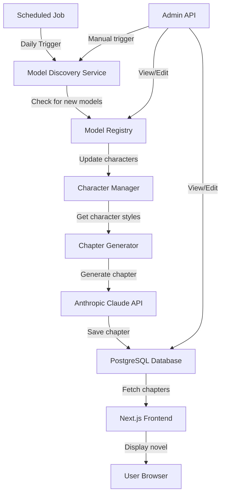

# Model Mythology - Self-Writing Novel Website

## Overview

A Next.js application that automatically generates and publishes daily novel chapters, where AI models are personified as mythological characters. Each chapter is written in the style of its character, and the system automatically discovers and incorporates new AI models into the mythology.

## Architecture




## Tech Stack

- **Framework**: Next.js 14+ (App Router) with TypeScript
- **Database**: PostgreSQL (Vercel Postgres)
- **AI Service**: Anthropic Claude API
- **Scheduling**: Vercel Cron Jobs (or external cron service)
- **Styling**: Tailwind CSS (or similar)

## Project Structure

```javascript
model-mythology/
├── app/                          # Next.js App Router
│   ├── page.tsx                  # Home page (novel chapters list)
│   ├── chapter/[id]/page.tsx     # Individual chapter view
│   ├── api/
│   │   ├── chapters/route.ts      # GET chapters, POST new chapter
│   │   ├── characters/route.ts   # GET characters, POST new character
│   │   ├── generate/route.ts     # Manual chapter generation trigger
│   │   └── cron/route.ts         # Cron endpoint for daily generation
│   └── layout.tsx
├── lib/
│   ├── db/
│   │   └── schema.ts             # Database schema (Drizzle ORM)
│   │   └── client.ts             # Database connection
│   ├── services/
│   │   ├── model-discovery.ts    # Pluggable model discovery service
│   │   ├── character-manager.ts  # Character creation/management
│   │   └── chapter-generator.ts  # Chapter generation logic
│   ├── ai/
│   │   └── anthropic.ts          # Anthropic Claude client
│   └── utils/
│       └── mythology.ts          # Character name/style generation
├── types/
│   └── index.ts                  # TypeScript types
├── components/
│   ├── ChapterList.tsx
│   ├── ChapterView.tsx
│   └── CharacterCard.tsx
├── prisma/                       # OR Drizzle migrations
│   └── schema.prisma
├── vercel.json                   # Cron job configuration
├── .env.example
└── package.json
```


## Database Schema

**Characters Table:**

- `id` (UUID, primary key)
- `model_name` (string, unique) - e.g., "gpt-4", "claude-3-opus"
- `character_name` (string) - e.g., "The Oracle GPT-4"
- `mythological_role` (string) - e.g., "Oracle", "Sage", "Trickster"
- `writing_style` (text) - Character's writing style description
- `discovered_at` (timestamp)
- `last_used_at` (timestamp)

**Chapters Table:**

- `id` (UUID, primary key)
- `chapter_number` (integer, unique)
- `title` (string)
- `content` (text)
- `character_id` (UUID, foreign key to Characters)
- `published_at` (timestamp)
- `created_at` (timestamp)

## Implementation Steps

### 1. Project Setup

- Initialize Next.js project with TypeScript
- Set up PostgreSQL database (Vercel Postgres)
- Configure Drizzle ORM or Prisma
- Set up environment variables (.env.local)

### 2. Database Schema

- Create Characters and Chapters tables
- Set up database migrations
- Create TypeScript types from schema

### 3. Model Discovery Service

- Create pluggable `ModelDiscoveryService` interface
- Implement placeholder/default discovery (can be replaced with custom logic)
- Add model registry to track discovered models
- Create API endpoint to manually trigger discovery

### 4. Character Management

- Auto-generate mythological character names from model names
- Generate writing styles based on model characteristics
- Create character management service
- Store characters in database

### 5. Chapter Generation

- Implement chapter generator using Anthropic Claude
- Create prompts that incorporate character style and mythology context
- Generate chapter content in character's voice
- Save chapters to database with metadata

### 6. API Routes

- `/api/chapters` - List and create chapters
- `/api/characters` - List and manage characters
- `/api/generate` - Manual chapter generation trigger
- `/api/cron/generate-daily` - Cron endpoint for daily generation

### 7. Frontend Components

- Home page with chapter list (newest first)
- Individual chapter view page
- Character information display
- Basic styling with Tailwind CSS

### 8. Scheduling

- Configure Vercel Cron Job to call `/api/cron/generate-daily` daily
- Add error handling and logging
- Implement idempotency (don't generate if chapter already exists for today)

### 9. Configuration

- Environment variables for Anthropic API key
- Database connection string
- Model discovery configuration (pluggable)

## Key Files to Create

1. **[lib/db/schema.ts](lib/db/schema.ts)** - Database schema definitions
2. **[lib/services/model-discovery.ts](lib/services/model-discovery.ts)** - Pluggable model discovery service
3. **[lib/services/character-manager.ts](lib/services/character-manager.ts)** - Character creation and management
4. **[lib/services/chapter-generator.ts](lib/services/chapter-generator.ts)** - Chapter generation with Anthropic
5. **[app/api/cron/generate-daily/route.ts](app/api/cron/generate-daily/route.ts)** - Daily generation endpoint
6. **[app/page.tsx](app/page.tsx)** - Home page with chapter list
7. **[vercel.json](vercel.json)** - Cron job configuration

## Model Discovery Interface

The model discovery service will be designed as a pluggable interface:

```typescript
interface ModelDiscoveryService {
  discoverNewModels(): Promise<ModelInfo[]>;
}

interface ModelInfo {
  name: string;
  provider?: string;
  capabilities?: string[];
  discoveredAt: Date;
}
```

This allows you to easily swap in your custom model discovery logic later.

## Chapter Generation Logic

1. Check if chapter already exists for today (idempotency)
2. Discover new models and add to mythology
3. Select character for this chapter (rotation or selection logic)
4. Generate chapter using Anthropic Claude with:

- Character's writing style
- Previous chapter context
- Mythology world-building

5. Save chapter to database
6. Update character's `last_used_at` timestamp

## Environment Variables

- `ANTHROPIC_API_KEY` - Anthropic API key
- `DATABASE_URL` - PostgreSQL connection string
- `MODEL_DISCOVERY_TYPE` - Type of discovery service to use (optional)

## Next Steps After Implementation

- Add authentication for admin features
- Implement chapter editing/regeneration
- Add character customization UI