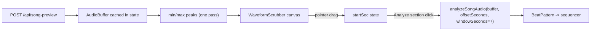

## Design



The fetched `AudioBuffer` is kept after first analysis so the user can re-analyze any window without re-downloading the preview.

## Changes

### 1) [src/audio/analyzeSongAudio.ts](src/audio/analyzeSongAudio.ts)

- Extend `AnalyzeSongAudioOptions` with optional `offsetSeconds` and `windowSeconds` (default `7`, min `~2`, capped to clip length).
- Replace `sliceMono(monoFull, sr)` with a slice based on `offsetSeconds` + `windowSeconds`, falling back to current behavior when neither is provided.
- Update the empty-pattern fallback name from "Audio too short" to something neutral like "Window too short" when the chosen window is too small. Existing tempo detection and bar-pick logic are reused unchanged on the slice.

Concretely:

```ts
const start = Math.max(0, Math.floor((options?.offsetSeconds ?? 0) * sr));
const winSec = Math.min(
  MAX_ANALYZE_SECONDS,
  Math.max(2, options?.windowSeconds ?? MAX_ANALYZE_SECONDS),
);
const end = Math.min(monoFull.length, start + Math.floor(winSec * sr));
const mono = monoFull.subarray(start, end);
```

(The current `MAX_ANALYZE_SECONDS = 45` becomes the upper cap; default for the scrubber path is `7` seconds.)

### 2) New `src/components/WaveformScrubber.tsx`

Pure presentational component:

- Props: `buffer: AudioBuffer`, `startSec: number`, `windowSec: number`, `onStartSecChange(s)`.
- Computes per-pixel min/max peaks from `buffer.getChannelData(0)` (mono downmix or just channel 0 for visual purposes), memoized on `buffer` + canvas pixel width.
- Renders a `<canvas>` with `devicePixelRatio` scaling: gray waveform, accent-colored highlighted slice from `startSec` to `startSec + windowSec`, draggable marker line at `startSec`.
- Pointer handlers (`pointerdown` / `pointermove` / `pointerup` with `setPointerCapture`) clamp the marker to `[0, duration - windowSec]` and call `onStartSecChange`.
- Keyboard support: arrow keys nudge by `0.1s`, shift-arrow nudges by `1s` for accessibility (`role="slider"`, `aria-valuemin/now/max`).

### 3) [src/components/SongBeatPanel.tsx](src/components/SongBeatPanel.tsx)

- Add state: `previewBuffer: AudioBuffer | null`, `previewName: string | null`, `startSec: number`. Constant `WINDOW_SEC = 7`.
- `fetchCatalogPreviewAndAnalyze`:
  - After decoding the preview, store `previewBuffer` and `previewName`, set `startSec = 0`, then call `analyzeBuffer(buffer, name, { offsetSeconds: 0, windowSeconds: WINDOW_SEC })`.
- New `analyzeBuffer` signature accepts options, forwards to `analyzeSongAudio`.
- New `analyzeCurrentSection()` (no fetch): runs `analyzeSongAudio(previewBuffer, { offsetSeconds: startSec, windowSeconds: WINDOW_SEC, patternName: previewName })` and applies it.
- New UI block, only shown when `previewBuffer` exists, between the lookup row and the existing hint:
  - `<WaveformScrubber>` and a small label like `0:00 / 0:30`, `Section: 0:12 - 0:19`.
  - Buttons: `Analyze section` (primary, disabled while busy) and `Reset to start` (secondary).
- Loading another preview replaces `previewBuffer` and resets `startSec`.

### 4) [src/components/SongBeatPanel.module.css](src/components/SongBeatPanel.module.css)

- Add `.waveformBlock` (margin/padding around the scrubber area), `.waveformCanvas` (full-width, fixed height ~64px, rounded, focus outline), `.timeLabels` (small muted timestamps row), and `.sectionRow` (flex row for the two action buttons).

## Notes

- No new dependencies; canvas peaks are computed in a single pass per buffer.
- Re-analyzing different sections does not refetch from the network; the cached `AudioBuffer` is reused.
- The `/api/song-preview` route is unchanged.
- `WINDOW_SEC = 7` is a single tunable constant; we can expose it as a slider later if desired.