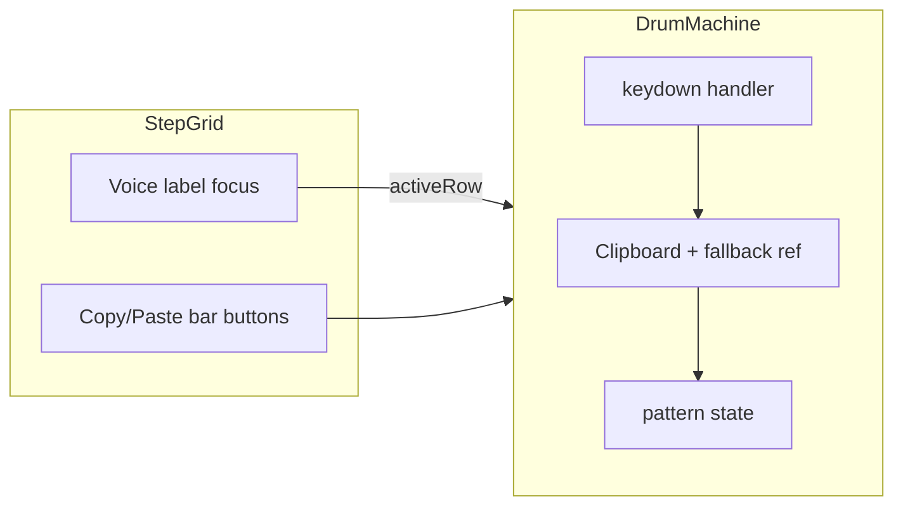

# Copy–paste row and full bar

## Context

- Pattern shape is fixed in [`src/state/pattern.ts`](src/state/pattern.ts): `ROWS` (12) × `STEPS` (16), `StepCell` 0|1|2 plus matching `stepGain` per cell.
- Grid UI lives in [`src/components/StepGrid.tsx`](src/components/StepGrid.tsx); voice name is a non-interactive `
`.
- Global keyboard handling already exists in [`src/app/components/DrumMachine.tsx`](src/app/components/DrumMachine.tsx) with `typing()` to skip `input`/`textarea`/etc., and pad mapping ignores `metaKey`/`ctrlKey` — copy/paste can safely use **Cmd/Ctrl + letter** in the same `keydown` listener (still return early when `typing()`).

**Semantics**

- **Row**: one voice’s 16 `steps` values and 16 `stepGain` values.
- **Full bar** (this app): all 12 rows × 16 columns — i.e. the entire grid body for one measure (there is no multi-bar timeline yet). This is still useful for “snapshot this groove,” paste after clearing, or moving data between browser tabs via the clipboard.

## Clipboard payload

Define a small versioned JSON schema (string on the system clipboard), e.g.:

- `{"80808Clip":"row","v":1,"steps":[...16],"gain":[...16]}`
- `{"80808Clip":"bar","v":1,"steps":[[...16],...×12],"gain":[[...],...×12]}`

Validate on paste: magic key, `v`, array lengths vs `ROWS`/`STEPS`, each step coerced like [`coerceStepCell`](src/state/pattern.ts), gains like [`clampStepGain`](src/state/pattern.ts). Reject silently or no-op on invalid data (avoid throwing on random clipboard text).

## Pure helpers ([`src/state/pattern.ts`](src/state/pattern.ts))

Add focused, testable functions, for example:

- `buildRowClip(pattern, row)` / `applyRowClip(pattern, targetRow, clip)` — deep-copy new `steps` and `stepGain`, replace only `targetRow`.
- `buildBarClip(pattern)` / `applyBarClip(pattern, clip)` — replace all rows’ `steps` and `stepGain`; leave `name` and `bpm` unchanged unless you explicitly want bar paste to be “full pattern” (recommend **leave name/bpm** so paste is strictly rhythmic).

Optional: `parseClipJson(text: string): RowClip | BarClip | null` colocated or in a tiny `src/state/clipboard.ts` if you prefer to keep `pattern.ts` smaller.

## Row focus (paste target)

Introduce **active row index** (`number | null`, default `null`):

- Lift state in `DrumMachine` (or keep in `StepGrid` and callback `onActiveRowChange`) — **lifting** keeps clipboard logic in one place.
- Make each voice label in `StepGrid` a **focusable control** (e.g. `<button type="button">` styled like today’s label, or `
`) that sets `activeRow = row` on click/focus. Show a clear selected style (existing CSS module).
- **Paste row** applies only when `activeRow !== null` and clipboard contains a row clip; if null, ignore or briefly use existing patterns for user feedback (project has no toast system — a `title` tooltip on Paste or a one-line `aria-live` “Select a voice row to paste” is enough).

## Keyboard shortcuts ([`DrumMachine.tsx`](src/app/components/DrumMachine.tsx))

Inside the existing `capture: true` `keydown` handler, after `typing()` check:

| Action | Suggested chord |
|--------|-----------------|
| Copy row | **Cmd/Ctrl + C** when a row is “active” (focused or last-selected) |
| Paste row | **Cmd/Ctrl + V** → row clip into `activeRow` |
| Copy bar | **Cmd/Ctrl + Shift + C** |
| Paste bar | **Cmd/Ctrl + Shift + V** |

Call `e.preventDefault()` when handling these so the browser does not steal focus. Mirror **Ctrl** on Windows/Linux.

**Async clipboard**: `navigator.clipboard.readText()` / `writeText()` are async — use `.then()` or `void` IIAFE; catch failures and optionally fall back to a **module-level ref** holding the last copied clip so Cmd+C / Cmd+V still works in restricted contexts without polluting `localStorage`.

## Touch / discoverability ([`StepGrid.tsx`](src/components/StepGrid.tsx))

Keyboard-only users get shortcuts; add minimal UI so phones are not blocked:

- In the compact header (next to “Step sequencer” / legend), add **Copy bar** and **Paste bar** text buttons calling props `onCopyBar` / `onPasteBar` implemented in `DrumMachine` (same logic as keyboard). Row copy/paste can stay keyboard-first, or add a compact “Copy row / Paste row” next to the focused row only — optional minimal path: **long-press or secondary affordance on voice label** is easy to miss; prefer **small row actions** (e.g. copy icon on the selected row only) only if you want parity without crowding every row.

Recommendation: **Bar buttons in header** + **keyboard for rows** + **legend line**: “Select a voice name, then ⌘C / ⌘V to copy or paste that row. ⌘⇧C / ⌘⇧V for the full bar.”

## Wiring summary

After successful paste, update `patternRef.current` if other effects depend on it (same as `onToggle`).

## Files to touch

| File | Change |
|------|--------|
| [`src/state/pattern.ts`](src/state/pattern.ts) (or new `clipboard.ts`) | Clip types, serialize, parse, apply |
| [`src/components/StepGrid.tsx`](src/components/StepGrid.tsx) + [`StepGrid.module.css`](src/components/StepGrid.module.css) | Focusable voice labels, selection style, bar buttons + props |
| [`src/app/components/DrumMachine.tsx`](src/app/components/DrumMachine.tsx) | `activeRow` state, clipboard read/write, key chords, wire props |
| [`README.md`](README.md) | One bullet under sequencer (optional; only if you want docs updated) |

## Out of scope (future-friendly)

- Copying a **subset of columns** (e.g. one beat = 4 steps) — not requested; schema `80808Clip` can later add `"range":{"from":0,"len":4}` without breaking `v:1` clients if parsers ignore unknown fields.
- **Undo** — separate feature; paste overwrites in one `setPattern` as today.
