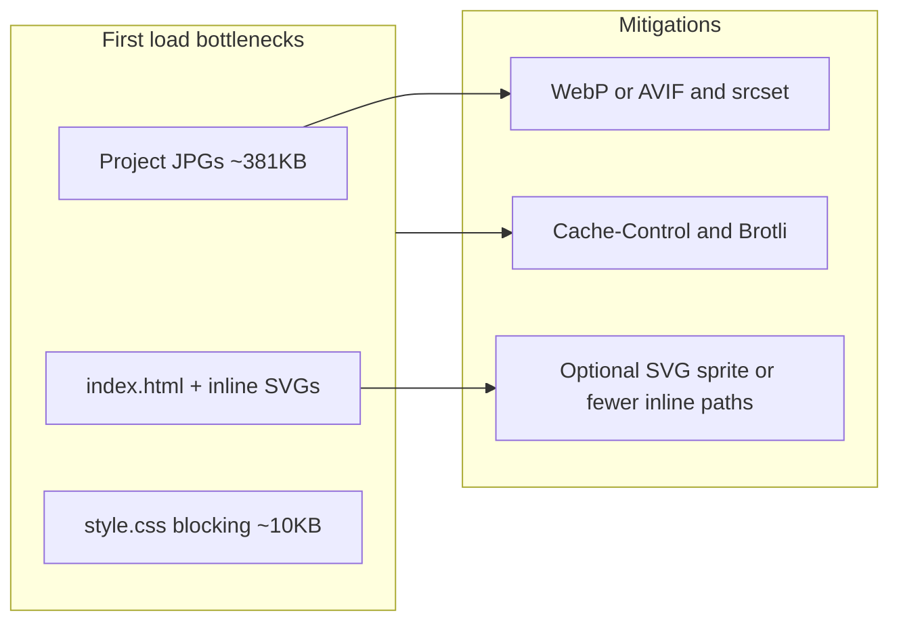

# Speed improvements for [erikholmberg.com](http://erikholmberg.com)

## Current baseline (from repo)

| Asset                      | Approx. size  | Notes                                              |
| -------------------------- | ------------- | -------------------------------------------------- |
| Project images (4× JPG)    | ~381 KB total | `[images/*.jpg](images/)` — dominant download cost |
| `[index.html](index.html)` | ~28 KB        | Large due to many inline SVGs in Experiences       |
| `[style.css](style.css)`   | ~10.5 KB      | Single blocking stylesheet (reasonable)            |
| `[script.js](script.js)`   | ~2.5 KB       | Already `defer`                                    |
| Fonts                      | 0             | System stack in CSS — no webfont blocking          |

You already preconnect to LinkedIn, GitHub, and GTM; the first project image uses `loading="eager"` + `fetchpriority="high"` (`[index.html](index.html)` ~line 96); GA loads with `defer`. No deploy config (e.g. `_headers`, `netlify.toml`) is in-repo, so cache/compression depends on your host.

## High impact

### 1. Image optimization (largest win)

- **Modern formats**: Serve **WebP** and/or **AVIF** (with JPG fallback via `<picture>`) or rely on a host/CDN that auto-optimizes (Cloudflare Polish, Imgix, etc.). Typical savings: **30–60%** vs current JPGs at same visual quality.
- **Recompress JPGs** if you stay on JPG only: tools like `jpegoptim`, `mozjpeg`, or Squoosh — quick win without HTML changes.
- `**srcset` / `sizes`**: Cards likely display below 500px wide; serving **smaller intrinsic widths** (e.g. 400–600w sources) cuts bytes on mobile and fits real layout.
- **Optional**: `<link rel="preload" as="image" href="..." imagesrcset="..." imagesizes="...">` for the LCP image if profiling shows it competing with CSS on slow connections.

### 2. HTTP caching and compression (host configuration)

- Set **long `Cache-Control`** for static assets (`style.css`, `script.js`, `/images/*`, `favicon.svg`). If you cannot fingerprint filenames, use a balance (e.g. **1 week–1 month** with **immutable** only if URLs are versioned).
- Ensure **Brotli** or gzip at the edge (most static hosts enable this by default).

*These don’t require code changes if configured on GitHub Pages + custom domain + Cloudflare, Netlify, Vercel, etc.*

## Medium impact

### 3. Reduce HTML weight (optional)

- Experiences section embeds **many large inline SVGs**, which inflates first-document download and parse work.
- **Options**: move icons to one external sprite/`symbols` SVG included once, replace with a tiny set of reused `<symbol>` references, or use a minimal inline subset. This is a **maintainability vs bytes** tradeoff; worthwhile if you care about TTFB/parse on slow devices.

### 4. Google Analytics loading strategy

- Today: inline `gtag('config', ...)` + deferred external script (`[index.html](index.html)` ~374–382). Acceptable, but still third-party work after load.
- **Optional**: load gtag **after `requestIdleCallback`**, **first interaction**, or a **short timeout** to improve Lighthouse “main thread” and third-party impact; analytics completeness vs speed tradeoff.

## Lower / situational impact

- **Inline critical CSS**: For ~10 KB full CSS, full critical CSS inlining is usually **not** worth the duplication; your blocking CSS cost is already small.
- **Preload `style.css`**: Minor on HTTP/2 if the HTML is small; try only if metrics show CSS starting late.
- **Service worker** for stale-while-revalidate: helps **repeat** visits, not first load.

## Suggested order of work

1. Compress / modernize images + `srcset` (measure LCP in Lighthouse or WebPageTest before/after).
2. Verify **caching + compression** on the live host.
3. If First Contentful Paint / LCP still tied to HTML: trim or externalize experience SVGs.
4. Tune GA load only if you need better lab scores and accept delayed hits.

No mandatory tooling changes in-repo beyond HTML/image updates and optional host config files if you want cache headers as code.