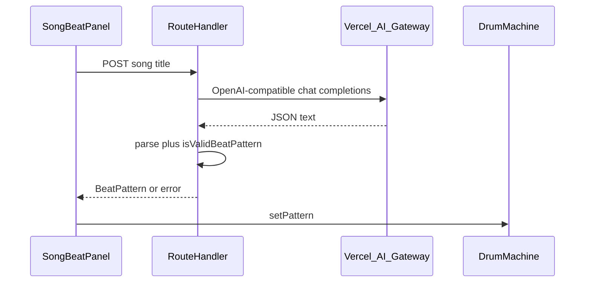

# Song name / voice → LLM → 808 pattern

## Context

- Patterns are [`BeatPattern`](src/state/pattern.ts): `{ name, bpm, steps }` with `steps` as **12 × 16 booleans** (rows follow [`VOICES`](src/voices.ts): BD, SD, LT, …).
- [`isValidBeatPattern`](src/state/pattern.ts) already validates shape and BPM range; reuse on the **server** before returning JSON to the client.
- There is **no `app/api` route** today; [`page.tsx`](src/app/page.tsx) only renders [`DrumMachine`](src/app/components/DrumMachine.tsx).

## Architecture

## Implementation

### 1. Route Handler (server-only secrets)

- Add [`src/app/api/song-beat/route.ts`](src/app/api/song-beat/route.ts) (`POST`).
- **Vercel AI Gateway** (OpenAI-compatible): use `fetch` to `{base}/chat/completions` where **base** defaults to `https://ai-gateway.vercel.sh/v1` and is overridable via optional env **`AI_GATEWAY_BASE_URL`** (same path suffix `/v1` as in Vercel docs).
- Auth: **`Authorization: Bearer ${process.env.AI_GATEWAY_API_KEY}`** (Vercel’s documented variable for the gateway key). If the key is missing, return **503** with a clear message.
- Optional **`AI_GATEWAY_MODEL`**: default e.g. **`openai/gpt-4o-mini`** (gateway uses **`provider/model`** IDs, not bare `gpt-4o-mini`).
- Request body: `{ "song": string }` (trim, max length ~120).
- Request body to gateway: same shape as OpenAI Chat Completions (`model`, `messages`, `response_format: { type: "json_object" }` where the chosen model supports it).
- **System + user messages** that demand **only** a single JSON object matching `BeatPattern`: `name` (string), `bpm` (number 40–200), `steps` (12 arrays of 16 booleans). Describe row order = `VOICES` order and that this is **one bar of 16th notes** inspired by the song’s feel (not a claim of accuracy).
- Parse assistant `content` as JSON; run `isValidBeatPattern`; on failure return **400** with a safe message (no key leakage).
- On success return `{ pattern: BeatPattern }` with `Content-Type: application/json`.

**Note:** No need for a direct `OPENAI_API_KEY` in this app if everything routes through the gateway; billing and provider keys are managed in Vercel as per your gateway setup.

### 2. Client UI component

- New component e.g. [`src/components/SongBeatPanel.tsx`](src/components/SongBeatPanel.tsx) + [`SongBeatPanel.module.css`](src/components/SongBeatPanel.module.css) (match existing flat tokens from [`globals.css`](src/app/globals.css)).
- UI elements:
  - Text input: song name.
  - **“Generate beat”** button → `fetch("/api/song-beat", { method: "POST", ... })`, show loading + error text.
  - **Mic / “Dictate”** button (feature-detect `globalThis.SpeechRecognition || globalThis.webkitSpeechRecognition`): start/stop recognition, `onresult` → set input value (default: fill only; user clicks Generate to avoid surprise API calls).
- If Speech Recognition is unavailable (common on some Safari builds), hide mic or show a one-line disabled hint.

### 3. Wire into [`DrumMachine.tsx`](src/app/components/DrumMachine.tsx)

- Render `SongBeatPanel` near the header or above [`Transport`](src/components/Transport.tsx) with props:
  - `onApplyPattern: (p: BeatPattern) => void` → `setPattern` with a **deep copy** of `steps` (same pattern as JSON import in [`DrumMachine.tsx`](src/app/components/DrumMachine.tsx)).
- Optional: set pattern `name` to something like `"Song · {userTitle}"` if you want to distinguish from LLM-returned `name` (product choice; can follow whatever the API returns if simpler).

### 4. Configuration and docs

- Add [`.env.example`](.env.example) with:
  - `AI_GATEWAY_API_KEY=` (required for this feature)
  - Optional `AI_GATEWAY_MODEL=openai/gpt-4o-mini`
  - Optional `AI_GATEWAY_BASE_URL=https://ai-gateway.vercel.sh/v1` (document default; omit in `.env.local` unless overriding)
- Short note in [`README.md`](README.md): song-to-beat feature needs `AI_GATEWAY_API_KEY`; local `npm run dev` loads from `.env.local`; link to [Vercel AI Gateway](https://vercel.com/docs/ai-gateway) / OpenAI compat docs.

## Risks / limits (call out in UI copy, one line)

- LLM output is **approximate / creative**, not transcription of a real recording.
- Voice uses browser STT (Google-backed in Chrome; varies elsewhere); iOS Safari support is inconsistent—text input remains the reliable path.

## Testing (manual)

- Without `AI_GATEWAY_API_KEY`: API returns 503 with clear message; UI shows error.
- With key: known song title returns valid pattern; `Play` and pads work unchanged.
