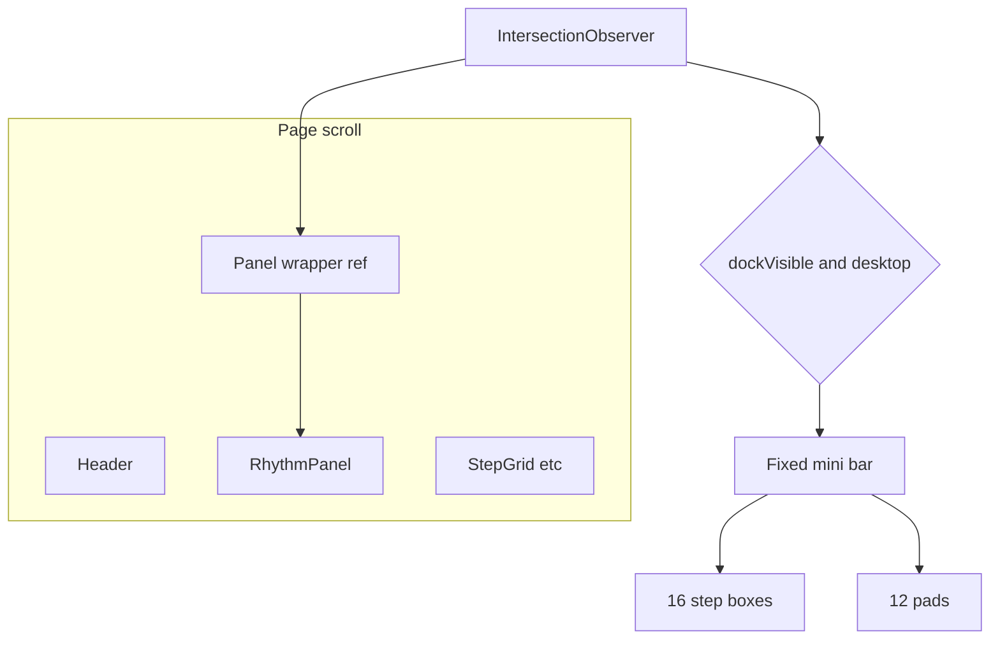

# Sticky mini bar for pads + beat steps

## Goal

When the user scrolls down so the main machine panel is no longer visible (grid editing below), show a **fixed bar** at the top of the viewport with:

1. The **16 step indicator boxes** (same band colors / playhead highlight as today).
2. The **12 drum pads** (same behavior as [`KeyboardMapLegend`](src/components/KeyboardMapLegend.tsx)).

**Scope:** desktop only (reuse the same breakpoint spirit as the app, e.g. **`min-width: 721px`** — aligns with [`StepGrid.module.css`](src/components/StepGrid.module.css) mobile cutoff). No dock on small screens.

## Detection

- Wrap [`RhythmPanel`](src/components/RhythmPanel.tsx) in a container with `ref`.
- **`IntersectionObserver`** on that container with `threshold: 0` (default): when **`isIntersecting` is false**, the whole panel has left the viewport → set **`dockVisible = true`**. When it becomes true again → **`dockVisible = false`**.
- Re-run or gate logic with **`matchMedia('(min-width: 721px)')`**: if not desktop, force **`dockVisible = false`** (listen for `change` on the media query so resize updates).

This matches “pads are off screen while I’m on the grid” without tying visibility to the grid sentinel (which would flicker if the panel is only partly visible).

## UI structure

- Render the dock **next to** the main tree (e.g. sibling in [`DrumMachine.tsx`](src/app/components/DrumMachine.tsx)), **`position: fixed; top: 0; left: 0; right: 0; z-index`** above content (e.g. `40`), **`display: none`** when hidden (or `visibility` + `pointer-events` — prefer **`display: none`** when inactive so it’s not tabbable).

## Avoid duplicate focusables

While **`dockVisible`**, the **step row + pads inside the main panel** should not be in the tab order / should not receive clicks meant for “the real” controls — simplest robust approach: wrap **only** the steps grid + `KeyboardMapLegend` inside [`RhythmPanel`](src/components/RhythmPanel.tsx) in a **`div`** that receives **`inert`** when a prop like **`padsSectionInert`** is true (forward from `DrumMachine`). Transport (name, BPM, Play, etc.) stays interactive.

- **`inert`** keeps focus management sane (supported in current Chromium/WebKit/Firefox).

The fixed bar’s pads/step indicators remain **interactive** when visible.

## Code organization (minimize duplication)

1. **Extract** the 16-step indicator markup from `RhythmPanel` into a small presentational component, e.g. [`src/components/BeatStepIndicatorRow.tsx`](src/components/BeatStepIndicatorRow.tsx) (+ optional `.module.css` or shared partial classes), props: **`playhead: number | null`**, **`density?: 'default' | 'compact'`** (smaller gaps / `stepNum` font for the dock).

2. **Pads:** add an optional prop to [`KeyboardMapLegend`](src/components/KeyboardMapLegend.tsx), e.g. **`variant="sticky"`** or **`dense`**: omit the title line; tighten padding / font sizes via new CSS module modifiers so two rows of 6 still fit in a short fixed bar. Reuse existing **`onPadDown` / `onPadUp` / `pressed`** behavior unchanged.

3. **Dock shell:** either a tiny **`DrumMachinePadsDock.tsx`** next to DrumMachine or inline JSX + styles in [`DrumMachine.module.css`](src/app/components/DrumMachine.module.css) (`.padsDock`, `.padsDockInner` max-width aligned with `.page`, background **`var(--dm-surface)`**, bottom border, subtle shadow).

## Polish

- **`prefers-reduced-motion`**: optional no animation on show/hide (dock can appear instantly).
- Ensure the dock doesn’t cover critical UI: keep height modest; no need for safe-area unless you later add a mobile dock.

## Files to touch

| File | Role |
|------|------|
| [`src/app/components/DrumMachine.tsx`](src/app/components/DrumMachine.tsx) | Panel wrapper ref, observer + media query state, render dock, pass **`padsSectionInert`** |
| [`src/components/RhythmPanel.tsx`](src/components/RhythmPanel.tsx) | **`padsSectionInert`**, wrap steps + legend in **`inert`** div; use **`BeatStepIndicatorRow`** |
| New **`BeatStepIndicatorRow`** (+ CSS) | Shared 16-box row |
| [`src/components/KeyboardMapLegend.tsx`](src/components/KeyboardMapLegend.tsx) + module CSS | **`dense` / `sticky`** variant |
| [`src/app/components/DrumMachine.module.css`](src/app/components/DrumMachine.module.css) | Fixed dock layout |

## Verification

- Desktop: scroll until panel fully leaves viewport → dock appears; pads and steps work; playhead updates while playing.
- Scroll panel back into view → dock hides; **`inert`** removed from panel section.
- Mobile/narrow: dock never shows.
- `npm run build`
