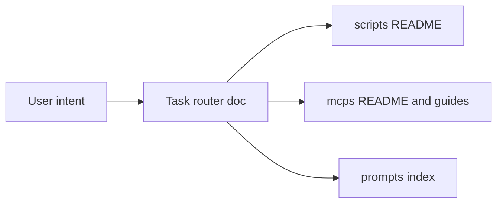

# Easier tool discovery and use

## Context

The toolkit spreads “tools” across three surfaces:

- **Scripts** — Strong coverage: [scripts/README.md](scripts/README.md) is a categorized index with sample CSVs.
- **MCP servers** — [mcps/README.md](mcps/README.md) lists servers; [mcps/guides/mcp-use-cases-for-pms.md](mcps/guides/mcp-use-cases-for-pms.md) gives scenario-style examples; each server has its own `README.md`.
- **Prompts** — No top-level index; discovery is by browsing `prompts/core-pm/`, `prompts/ai-ml/`, `prompts/developer-community/` and `*.prompt.md` naming.

There is also **doc drift**: the root [README.md](README.md) “What’s inside” row for **mcps** still says “Jira, Confluence, and GitHub” while the same file’s “Finding things” line and [mcps/README.md](mcps/README.md) list Slack, Braintrust, LangSmith, Notion, Product Analytics, etc. [docs/suggested-tools.md](docs/suggested-tools.md) still frames “product analytics (read-only)” as a future MCP, but [mcps/README.md](mcps/README.md) already lists [product-analytics-pm-tools](mcps/servers/product-analytics-pm-tools/) as Ready—confusing for anyone choosing what to install.

---

## Recommendations (prioritized)

### 1. Fix and align “source of truth” copy (high impact, low effort)

- Update the root README **mcps** row in the “What’s inside” table to match the full server set (or shorten to “Jira, Confluence, GitHub, Slack, Notion, …” + link to [mcps/README.md](mcps/README.md)).
- Refresh [docs/suggested-tools.md](docs/suggested-tools.md) so implemented MCPs (e.g. Notion, product analytics) are clearly marked done and the “suggested” table only lists gaps—reduces wrong conclusions when skimming.

### 2. Add a task-based “router” (high impact for humans + LLMs)

Add **one** short doc (e.g. `docs/tool-picker.md` or a new section in [README.md](README.md) “Finding things”) with **job-to-be-done rows**, each pointing to the right asset:

| Intent (example)                             | Start here                                                                                          |
| -------------------------------------------- | --------------------------------------------------------------------------------------------------- |
| Size an A/B test, interpret results          | `scripts/ab-test-calculator.py`, `experiment-result-interpreter.py`                                 |
| Connect Jira / Confluence / GitHub in Cursor | [mcps/README.md](mcps/README.md) + [mcps/guides/mcp-setup-guide.md](mcps/guides/mcp-setup-guide.md) |
| Draft a PRD / roadmap / stakeholder update   | `templates/`, `prompts/core-pm/*.prompt.md`                                                         |

Optionally mirror 3–5 rows in [workflows/daily-ai-pm-workflow.md](workflows/daily-ai-pm-workflow.md) so daily workflow doc links into concrete files.

This beats expanding README further: one place optimized for “I know my goal, not the filename.”

### 3. Prompts: minimal index (medium impact)

There is no [prompts/README.md](prompts/README.md). A compact table (by folder + one line per prompt file) or a **tag line** per file in a single index would make prompts as discoverable as scripts. Match the style of [scripts/README.md](scripts/README.md) (category tables, links).

### 4. MCP: help models pick the right *tool* (medium impact)

Hosts (Cursor, Claude) choose tools from `name` + `description` + schema. Improvements that help without UI changes:

- **Consistent description pattern** across tools in [mcps/servers/*/src/index.ts](mcps/servers/) — e.g. prefix with **“Use when:”** or **“PM use case:”** so embeddings and models align user intent with the right tool.
- **Optional consolidated reference**: a generated or hand-maintained markdown table “Server → tool name → one-line use case” (could live in [mcps/README.md](mcps/README.md) or `mcps/TOOLS.md`) for users who configure MCP manually and for documentation search.

### 5. Scripts: optional keyword affordance (lower priority)

The script index is long. Low-cost options:

- A **“Common questions”** subsection at the top of [scripts/README.md](scripts/README.md) (“How long to run my test?” → `experiment-duration-calculator.py`, etc.).
- Or a tiny **keyword appendix** (grep-friendly) at the bottom: `ab-test`, `slo`, `roi` → script filenames.

Avoid building a separate CLI “finder” unless you outgrow markdown.

### 6. Agent/cursor rules (optional)

If you use [agents/rules/](agents/rules/) in this repo, add one rule: when the user asks for integrations or live data, **prefer linking** [mcps/README.md](mcps/README.md) and [mcp-use-cases-for-pms.md](mcps/guides/mcp-use-cases-for-pms.md) before inventing workflows—improves consistency for Cursor users.

---

## What not to do (unless needed)

- **Full auto-generated MCP tool registry JSON** — useful at scale; for ~8 servers, a maintained markdown table is usually enough.
- **Large renames** of MCP tool `name` fields — can break existing configs; prefer richer descriptions first.

---

## Summary diagram (information architecture)

